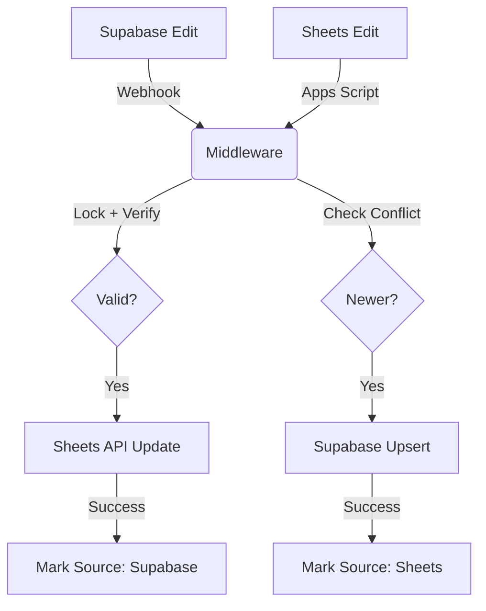

# Architecture: Supabase Mirror

Supabase Mirror is a middleware service designed for robust, bidirectional synchronization between Supabase (PostgreSQL) and Google Sheets.

## System Workflow

## Key Components

### 1. The Middleware (`index.js`)

An Express server that routes requests from both providers. It handles:

- **Signature Verification**: Ensures webhooks are legitimate.
- **Queueing**: Uses `p-queue` to prevent rate-limit errors during bulk updates.
- **Locking**: Uses Redis to prevent "sync loops" where an update triggers itself back and forth.

### 2. Generic Mapping (`lib/sync-logic.js`)

Instead of hardcoding column names, the system:

1. Fetches the Google Sheet headers at runtime.
2. Maps database records to those headers by key.
3. Allows users to add or remove columns in the sheet without breaking the sync.

### 3. Conflict Resolution

The system uses a `synced_at` timestamp in both locations. If two edits happen simultaneously, the middleware compares the timestamps to ensure the most recent data wins.

### 4. Resilient Auth (`lib/sheets-client.js`)

To simplify production deployment, the middleware includes a "Key Scrubber" that automatically formats service account keys, handling common copy-paste errors involving quotes and escaped newlines.
